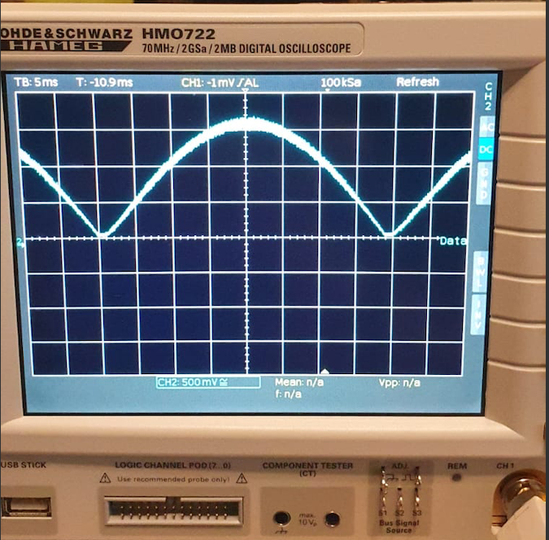

# Steuerung einer Einphasenasynchronmaschine

_Im Rahmen des Projektes soll ein einfaches PWM Modul entwickelt werden, mit dem ein 1-Phasen-Asynchronmotor drehzahlvariabel angesteuert wird. Mit diesem soll es möglich sein, einen 1-Phasen-Asynchronmotor anzusteuern._

## Systemanforderung

1.  Option 1
    - Systemworkbench (Eclipse)
    - STM32CubeMX
2.  Option 2
    - STM32CubeIDE

## Wechselrichter Libary

Um Berechnungen und den Prescaler zu ändern, wurde aus Übersichtsgrunde eine Libary erstellt. `Wechselrichter.c`

Herleitung der Formel zur Errechnung der Abtastpunkte des Sinus -> Funktion `getPWM_Array1`und `getPWM_Array2`.

1. Errechnung von Omega „ω“:
   ω= 2 π f
2. Errechnung des Winkels „α“:
   Da wir nur eine Halbwelle des Sinus errechnen, wird mit 180° gerechnet. Wir haben 255 Abtastpunkte festgelegt:
   α = 180°/ 255 Abtastpunkte \* Wert(0-255)
3. Errechnung der Winkelzeit“αt“:
   Für die Berechnung der Winkelzeit wird der Sollwert und der Winkel benötigt. Der Sollwert wird von Herz in Millisekunden umgerechnet und durch 360 geteilt, da die Frequenz auf eine ganze Periode bezogen ist, danach wird dieser wert mit dem aktuellen Winkel multipliziert:
   αt= ((1 / f) / 360) \* α
4. Berechnung der Pulsweite ton:
   Für die Berechnung der Pulsweite wird Omega die Winkelzeit und der Sollwert benötigt. Es wird der Sinus der Multiplikation von Omega und der Winkelzeit genommen und mit einem dem Produkt aus dem Sollwert und einem Faktor multipliziert:
   ton= (sin (ω _ αt)) _ (Faktor \* Sollwert)
5. Der errechnete Wert wird in ein Array geschrieben

Das setzten des Prescaler für das PWM signal wird durch die funktion -> `NEW_Pres` durchgeführt.

## Teseten der Ausgabe mit Oszilloskop

Ausgabe des Signales mit einer Testschaltung sieht wie folgt aus.

### Ausgabe Sinus ohne Negativ Halbwelle

### Ausgabe Sinus

